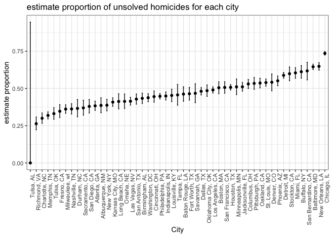

p8105\_hw5\_kz2334
================
Kangkang Zhang
11/7/2018

Problem 1
---------

Load required packages.

``` r
#load packages
library(tidyverse)
library(viridis)
```

<br> Import file names to create a dataframe.

``` r
file_name = tibble(
  id = list.files("./data/")
)
```

<br> Read in data for each subject.

``` r
study_data = file_name %>% 
  mutate(infor = purrr::map(str_c("./data/", id), read_csv)) 

study_data
```

    ## # A tibble: 20 x 2
    ##    id         infor           
    ##    <chr>      <list>          
    ##  1 con_01.csv <tibble [1 × 8]>
    ##  2 con_02.csv <tibble [1 × 8]>
    ##  3 con_03.csv <tibble [1 × 8]>
    ##  4 con_04.csv <tibble [1 × 8]>
    ##  5 con_05.csv <tibble [1 × 8]>
    ##  6 con_06.csv <tibble [1 × 8]>
    ##  7 con_07.csv <tibble [1 × 8]>
    ##  8 con_08.csv <tibble [1 × 8]>
    ##  9 con_09.csv <tibble [1 × 8]>
    ## 10 con_10.csv <tibble [1 × 8]>
    ## 11 exp_01.csv <tibble [1 × 8]>
    ## 12 exp_02.csv <tibble [1 × 8]>
    ## 13 exp_03.csv <tibble [1 × 8]>
    ## 14 exp_04.csv <tibble [1 × 8]>
    ## 15 exp_05.csv <tibble [1 × 8]>
    ## 16 exp_06.csv <tibble [1 × 8]>
    ## 17 exp_07.csv <tibble [1 × 8]>
    ## 18 exp_08.csv <tibble [1 × 8]>
    ## 19 exp_09.csv <tibble [1 × 8]>
    ## 20 exp_10.csv <tibble [1 × 8]>

<br> Tidy the result and manipulate file names to include control arm and subject ID.

``` r
study_data = study_data %>%
  mutate( id = str_replace(id, ".csv", "")) %>% 
  separate(id, into = c("arm", "id"), sep = "_") %>%
  unnest() %>% 
  gather(week, value = value, week_1:week_8) %>% 
  mutate(week = as.numeric(str_replace(week, "week_", "")))

study_data
```

    ## # A tibble: 160 x 4
    ##    arm   id     week value
    ##    <chr> <chr> <dbl> <dbl>
    ##  1 con   01        1  0.2 
    ##  2 con   02        1  1.13
    ##  3 con   03        1  1.77
    ##  4 con   04        1  1.04
    ##  5 con   05        1  0.47
    ##  6 con   06        1  2.37
    ##  7 con   07        1  0.03
    ##  8 con   08        1 -0.08
    ##  9 con   09        1  0.08
    ## 10 con   10        1  2.14
    ## # ... with 150 more rows

<br> Make a spaghetti plot showing observations on each subject over time.

``` r
study_data %>%  
  ggplot(aes(x = week, y = value, color = id, linetype = arm)) + 
  geom_line() +
  labs(
    title = "Spaghetti plot",
    x = "Week",
    y = "Observation"
  ) +
  theme_bw() +
  scale_x_discrete(breaks=seq(0, 8, 1)) +
  scale_linetype_discrete(label = c("Control", "Experimental")) +
  scale_color_viridis(discrete = TRUE)
```


Globally, experimental group has larger observation values than control group. In experimental group, observations increased as time went by. In control group, observations fluctuated within an interval as time went by.

Problem 2
---------

Import and describe the raw data.

``` r
homicide_data = read_csv("./p2_data/homicide-data.csv")

homicide_data
```

    ## # A tibble: 52,179 x 12
    ##    uid   reported_date victim_last victim_first victim_race victim_age
    ##    <chr>         <int> <chr>       <chr>        <chr>       <chr>     
    ##  1 Alb-…      20100504 GARCIA      JUAN         Hispanic    78        
    ##  2 Alb-…      20100216 MONTOYA     CAMERON      Hispanic    17        
    ##  3 Alb-…      20100601 SATTERFIELD VIVIANA      White       15        
    ##  4 Alb-…      20100101 MENDIOLA    CARLOS       Hispanic    32        
    ##  5 Alb-…      20100102 MULA        VIVIAN       White       72        
    ##  6 Alb-…      20100126 BOOK        GERALDINE    White       91        
    ##  7 Alb-…      20100127 MALDONADO   DAVID        Hispanic    52        
    ##  8 Alb-…      20100127 MALDONADO   CONNIE       Hispanic    52        
    ##  9 Alb-…      20100130 MARTIN-LEY… GUSTAVO      White       56        
    ## 10 Alb-…      20100210 HERRERA     ISRAEL       Hispanic    43        
    ## # ... with 52,169 more rows, and 6 more variables: victim_sex <chr>,
    ## #   city <chr>, state <chr>, lat <dbl>, lon <dbl>, disposition <chr>

This dataset contains 52179 rows and 12 columns, with each row resprenting a single homicide record over the past decade in 50 of the largest American cities. Variables include record ID, reported date, victim's name, victim's race, victim's age, victim's sex, city and state, homicide location, and disposition. <br>

------------------------------------------------------------------------

Create a `city_state` variable and then summarize within cities to obtain the total number of homicides and the number of unsolved homicides.

``` r
homicide_data = homicide_data %>% 
  mutate(city_state = str_c(city, ", ", state)) 

prop_data = homicide_data %>%
  group_by(city_state) %>% 
  summarise(num_homicide = n(),
            num_unsolved_homi = sum(disposition %in% c("Closed without arrest", "Open/No arrest"))) %>% 
  arrange(desc(num_homicide))

prop_data
```

    ## # A tibble: 51 x 3
    ##    city_state       num_homicide num_unsolved_homi
    ##    <chr>                   <int>             <int>
    ##  1 Chicago, IL              5535              4073
    ##  2 Philadelphia, PA         3037              1360
    ##  3 Houston, TX              2942              1493
    ##  4 Baltimore, MD            2827              1825
    ##  5 Detroit, MI              2519              1482
    ##  6 Los Angeles, CA          2257              1106
    ##  7 St. Louis, MO            1677               905
    ##  8 Dallas, TX               1567               754
    ##  9 Memphis, TN              1514               483
    ## 10 New Orleans, LA          1434               930
    ## # ... with 41 more rows

We can see from the chart that Chicago is the city with the largest number of homicides, 5535. <br>

For the city of Baltimore, MD, estimate the proportion of homicides that are unsolved; pull the estimated proportion and confidence intervals from the resulting tidy dataframe.

``` r
Baltimore_data = prop_data %>%
  filter(city_state == "Baltimore, MD") 

#proportion test  
result = prop.test(Baltimore_data$num_unsolved_homi, Baltimore_data$num_homicide)

#pull estimated proportion
broom::tidy(result) %>% 
  pull(estimate)
```

    ## [1] 0.6455607

``` r
#pull lower side of CI
broom::tidy(result) %>% 
  pull(conf.low)
```

    ## [1] 0.6275625

``` r
#pull upper side of CI
broom::tidy(result) %>% 
  pull(conf.high)
```

    ## [1] 0.6631599

The estimated proportion is 0.6455607, 95% confidence interval is (0.6275625, 0.6631599). <br>

------------------------------------------------------------------------

Run prop.test for each of the cities in your dataset, and extract both the proportion of unsolved homicides and the confidence interval for each.

``` r
#create function for tidy results
prop_test_result = function(x, n){
  
  results = prop.test(x, n)
  
  broom::tidy(results) 

}

#map function and create tidy dataframe
prop_data = prop_data %>%
 mutate(results = purrr::map2(num_unsolved_homi, num_homicide, prop_test_result)) %>% 
 unnest() %>% 
 select(city_state, num_homicide, num_unsolved_homi, estimate, conf.low, conf.high)

prop_data
```

    ## # A tibble: 51 x 6
    ##    city_state    num_homicide num_unsolved_ho… estimate conf.low conf.high
    ##    <chr>                <int>            <int>    <dbl>    <dbl>     <dbl>
    ##  1 Chicago, IL           5535             4073    0.736    0.724     0.747
    ##  2 Philadelphia…         3037             1360    0.448    0.430     0.466
    ##  3 Houston, TX           2942             1493    0.507    0.489     0.526
    ##  4 Baltimore, MD         2827             1825    0.646    0.628     0.663
    ##  5 Detroit, MI           2519             1482    0.588    0.569     0.608
    ##  6 Los Angeles,…         2257             1106    0.490    0.469     0.511
    ##  7 St. Louis, MO         1677              905    0.540    0.515     0.564
    ##  8 Dallas, TX            1567              754    0.481    0.456     0.506
    ##  9 Memphis, TN           1514              483    0.319    0.296     0.343
    ## 10 New Orleans,…         1434              930    0.649    0.623     0.673
    ## # ... with 41 more rows

<br> Create a plot that shows the estimates and CIs for each city. Organize cities according to the proportion of unsolved homicides.

``` r
prop_data %>% 
  mutate(unsolved_prop = num_unsolved_homi/num_homicide,
    city_state = fct_reorder(city_state, unsolved_prop)) %>% 
  ggplot(aes(x = city_state, y = estimate)) +
  geom_point() +
  geom_errorbar(aes(ymin = conf.low, ymax = conf.high), width = 0.2) +
  theme_bw() +
  theme(axis.text.x = element_text(angle = 90, hjust = 1)) +
  labs(
    title = "estimate proportion of unsolved homicides for each city",
    x = "City",
    y = "estimate proportion"
  ) 
```



From the plot we can see that Chicago has the largest esitmate and narrowest CI of proportion of unsolved homicides. We notice that there is abnormal CI for Tulsa, AL. It turns out that the number of homicides and the number of unsolved homicides in Tulsa is 1 and 0. The size is too small, resulting in bias in chi-square test.
